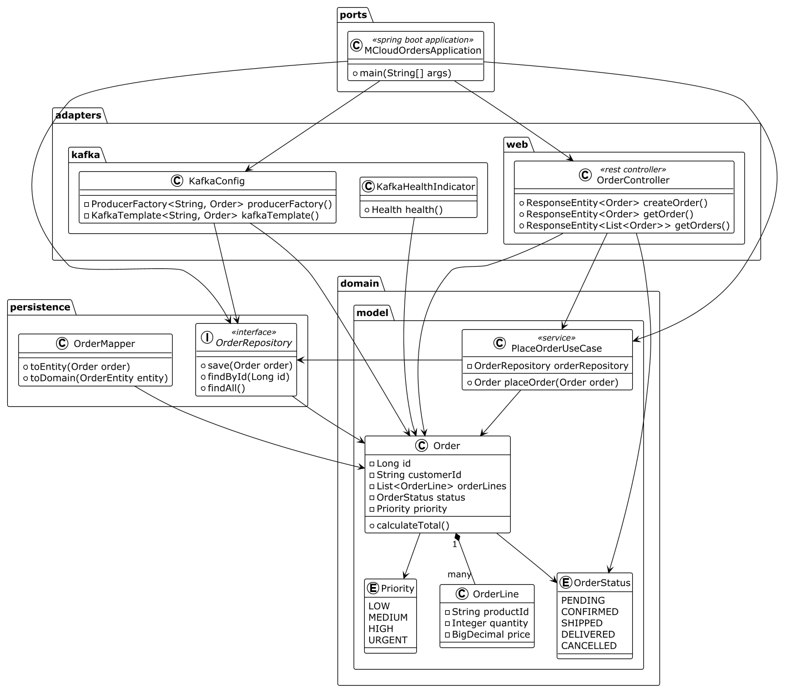

# Order Service API

## API Endpoints

### Orders

| Метод | Endpoint | Описание | Curl команда | HTTPie команда |
|-------|----------|----------|--------------|----------------|
| POST | `/api/orders` | Создать новый заказ | `curl -X POST http://localhost:8080/api/orders -H "Content-Type: application/json" -d '{"customerId":"cust-123","items":[{"productId":"prod-1","quantity":2,"price":100.00}]}'` | `http POST :8080/api/orders customerId=cust-123 items:='[{"productId":"prod-1","quantity":2,"price":100.00}]'` |
| GET | `/api/orders/{id}` | Получить заказ по ID | `curl http://localhost:8080/api/orders/1` | `http :8080/api/orders/1` |
| GET | `/api/orders` | Получить все заказы | `curl http://localhost:8080/api/orders` | `http :8080/api/orders` |
| GET | `/api/orders?customerId={id}` | Получить заказы клиента | `curl "http://localhost:8080/api/orders?customerId=cust-123"` | `http :8080/api/orders customerId==cust-123` |
| PUT | `/api/orders/{id}/status` | Обновить статус заказа | `curl -X PUT http://localhost:8080/api/orders/1/status -H "Content-Type: application/json" -d '{"status":"CONFIRMED"}'` | `http PUT :8080/api/orders/1/status status=CONFIRMED` |
| DELETE | `/api/orders/{id}` | Отменить заказ | `curl -X DELETE http://localhost:8080/api/orders/1` | `http DELETE :8080/api/orders/1` |

### Order Items

| Метод | Endpoint | Описание | Curl команда | HTTPie команда |
|-------|----------|----------|--------------|----------------|
| POST | `/api/orders/{orderId}/items` | Добавить товар к заказу | `curl -X POST http://localhost:8080/api/orders/1/items -H "Content-Type: application/json" -d '{"productId":"prod-2","quantity":1,"price":50.00}'` | `http POST :8080/api/orders/1/items productId=prod-2 quantity:=1 price:=50.00` |
| PUT | `/api/orders/{orderId}/items/{itemId}` | Обновить товар в заказе | `curl -X PUT http://localhost:8080/api/orders/1/items/1 -H "Content-Type: application/json" -d '{"quantity":3}'` | `http PUT :8080/api/orders/1/items/1 quantity:=3` |
| DELETE | `/api/orders/{orderId}/items/{itemId}` | Удалить товар из заказа | `curl -X DELETE http://localhost:8080/api/orders/1/items/1` | `http DELETE :8080/api/orders/1/items/1` |

### Health & Metrics

| Метод | Endpoint | Описание | Curl команда | HTTPie команда |
|-------|----------|----------|--------------|----------------|
| GET | `/actuator/health` | Проверка здоровья сервиса | `curl http://localhost:8080/actuator/health` | `http :8080/actuator/health` |
| GET | `/actuator/metrics` | Метрики приложения | `curl http://localhost:8080/actuator/metrics` | `http :8080/actuator/metrics` |
| GET | `/actuator/prometheus` | Метрики в формате Prometheus | `curl http://localhost:8080/actuator/prometheus` | `http :8080/actuator/prometheus` |

### Примеры Request Body

#### Создание заказа
```json
{
  "customerId": "cust-123",
  "items": [
    {
      "productId": "prod-1",
      "quantity": 2,
      "price": 100.00
    },
    {
      "productId": "prod-2",
      "quantity": 1,
      "price": 50.00
    }
  ]
}
```

#### Обновление статуса
```json
{
  "status": "CONFIRMED"
}
```

Возможные статусы: `PENDING`, `CONFIRMED`, `SHIPPED`, `DELIVERED`, `CANCELLED`

### Postman Collection

Импортируйте коллекцию из файла `docs/postman/Order-Service.postman_collection.json`

1. Откройте Postman
2. Нажмите `Import`
3. Выберите файл `Order-Service.postman_collection.json`
4. Коллекция появится в левом меню

